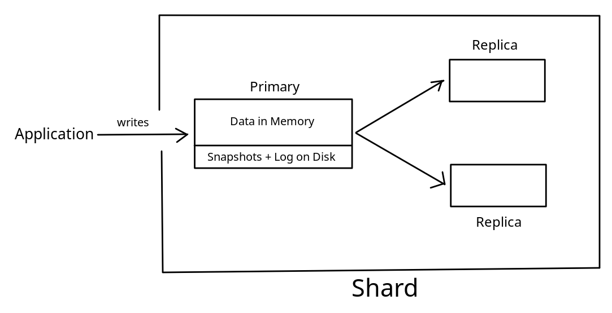
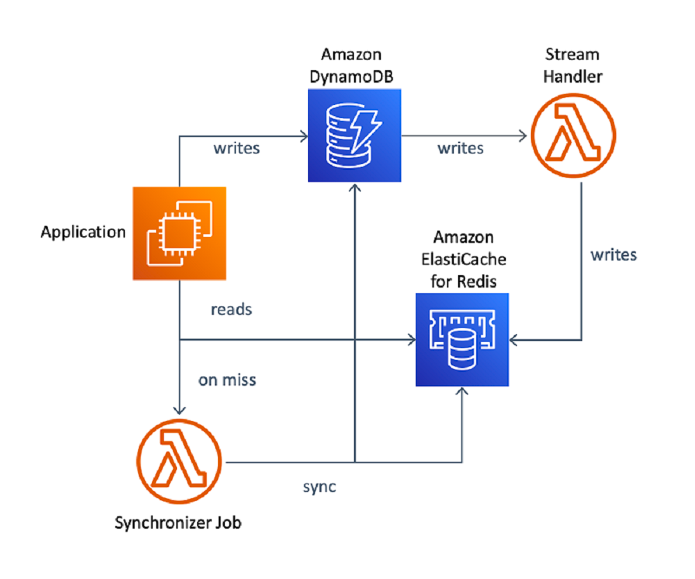
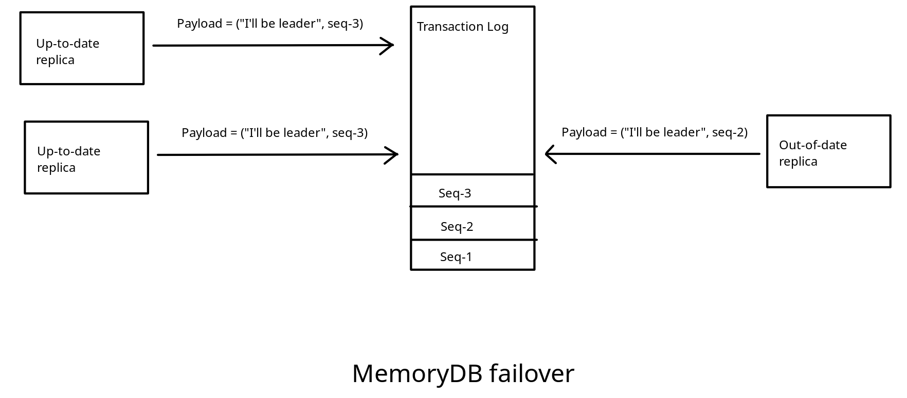
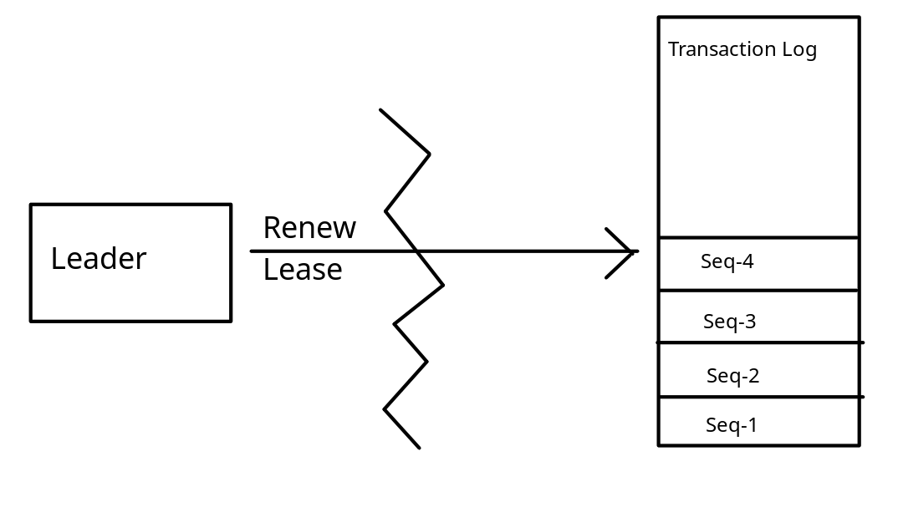
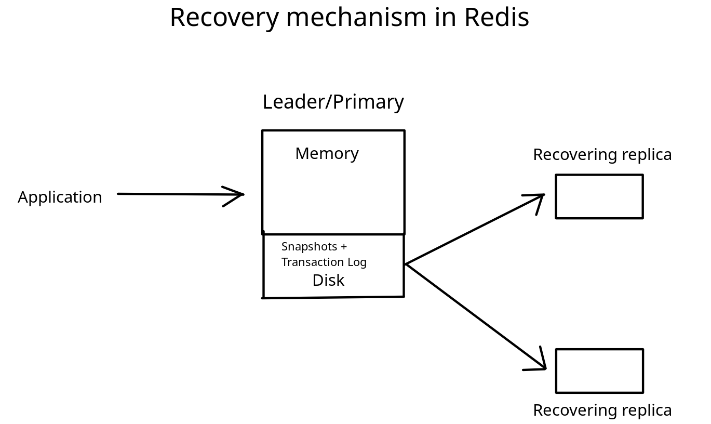
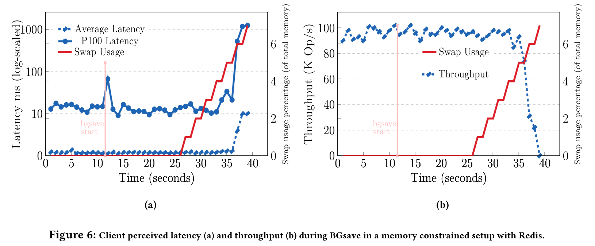
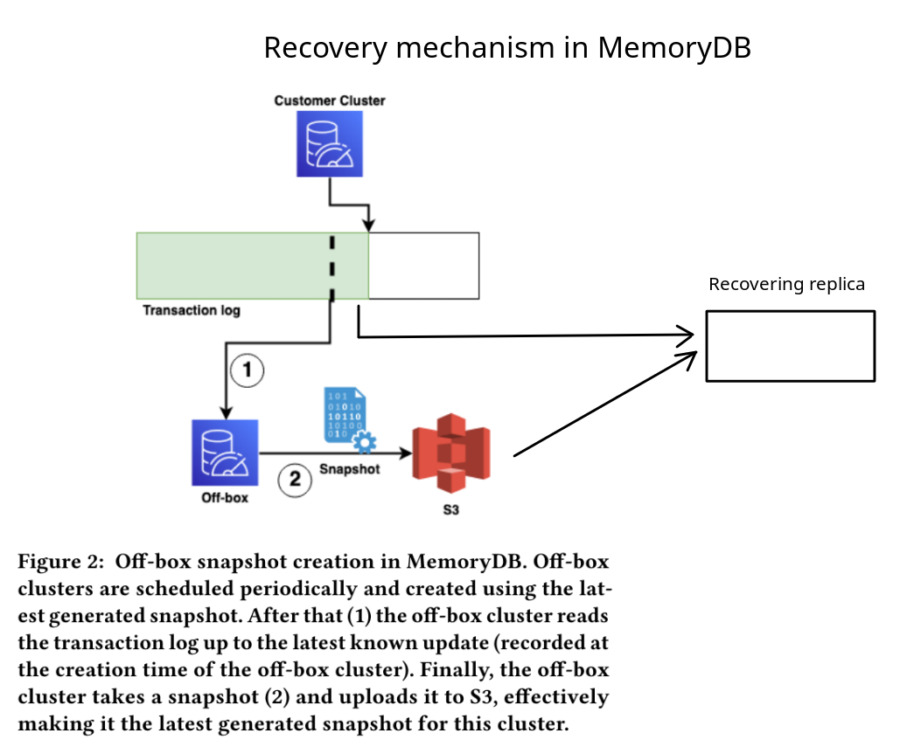
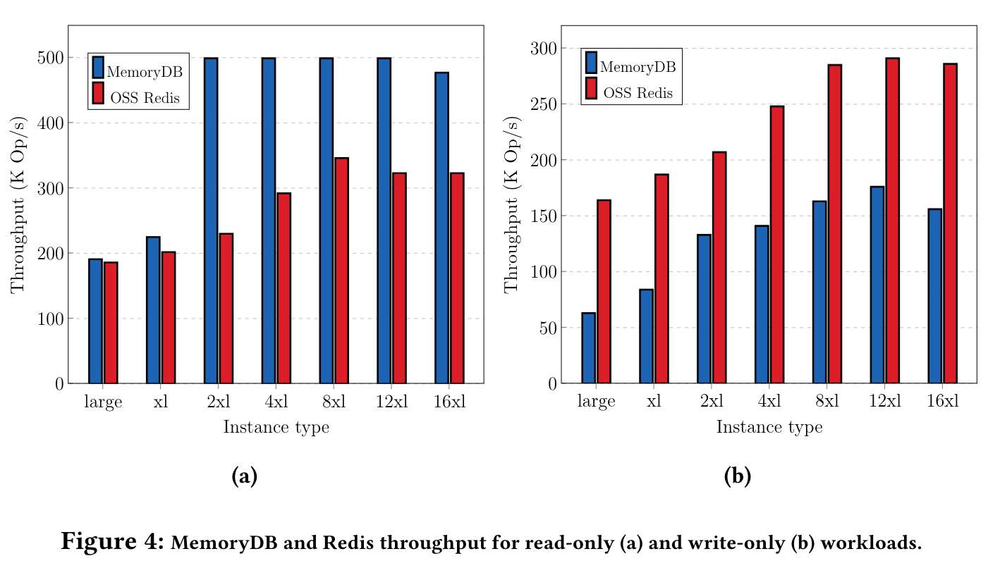
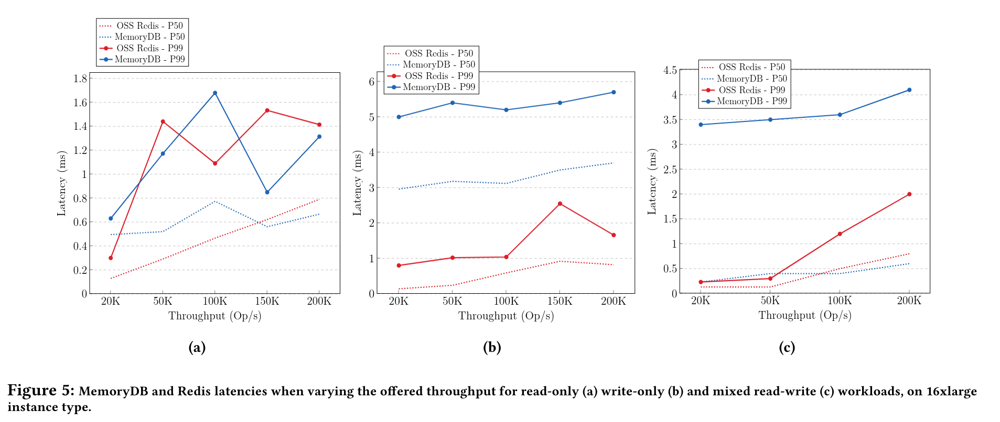

# What is MemoryDB

Cloud offering from AWS built on top of OSS Redis to provide enhanced
durability, allowing for use-cases beyond just caching.

# Use case

## Issues with Redis



Durability problems.

Failover will cause a permanent loss of the writes that were not replicated to
the promoted node at the time of failure

Transaction log and snapshots only useful in the case of single node per shard,
which is bad for availability, and not how most users setup their clusters.

- `fsync` configuration: for on disk transaction log -- useful for single node
  case only
- `WAIT`: client blocked until all prior updates that have been executed are
  acknowledged by a configurable number of replicas -- no guarantee that
  up-to-date node will be new leader

Redis is good as a data store because it provides features to store complex
data-structures in memory (not just a basic Key-Value store).

Customers would like to use it as a in-memory database, but to do so currently,
they need to build complex pipelines to make sure data in Redis remains
consistent and up-to-date.

```quote
Redis employs asynchronous replication for high availability and read scaling
and an on-disk transaction log for local durability. Redis does not offer a
replication solution that can tolerate the loss of nodes without data loss, or
can offer scalable strongly-consistent reads. This limits its ability to be
leveraged for use cases beyond caching.
```



```quote
Our customers asked us for a solution to allow Redis to be used as a primary
database with multi-Availability Zone (AZ) 1 durability.
```

Amazon MemoryDB provides:

- 11 9s of durability (similar to S3)
- single-digit millisecond writes
- microsecond read latencies
- fully compatible with Redis API

# Working

### Decoupling durability

```quote
MemoryDB offloads durability by leveraging a distributed transaction log
service. A transaction log provides low-latency and strongly consistent commits
across multiple AZs.
```

```quote
We use Redis as an in-memory execution and storage engine but redirect its
existing replication stream into the transaction log, which is responsible for
propagation of writes to replicas and leader election
```

### Maintaining Consistency

```quote
After a client sends a mutation, the reply from the mutation operation is stored
in a tracker until the transaction log acknowledges persistence and only then
sent to the client.
```

```quote
A common pattern is to intercept requests prior to execution, store them in the
transaction log, and once committed, allow nodes to execute them from the log.
This is called active replication and is often used with consensus algorithms
like Paxos or Raft. In active replication, commands in the log must apply
deterministically on all nodes, or different nodes may end up with different
results.

MemoryDB instead relies on passive replication, where a single primary executes
a command and replicates its resulting effects, making them deterministic.
```


## Other benefits

Replica required only to enhance availability, not for durability:

```quote
Many MemoryDB customers operate shards with either a primary only or a primary
with a single replica, but still receive durability across three AZs, which
would not be possible if compute and storage were coupled.
```

Better billing:

```quote
A loosely coupled transaction log service to provide durability allows it to
scale independently from the in-memory engine. Therefore, the amount (and thus
cost) of availability can be varied independently of the cost of durability
```

## Leader election

### How does OSS Redis detect failed leader/primary?

- Majority-quorum
- Heartbeats over cluster bus
- Majority does not receive heartbeats -> leader has failed

### Issues with leader election in OSS Redis

```quote
Replicas are chosen using a ranking algorithm, trying to promote the most
up-to-date replica based on the local perspective of each voting node. There is
no guarantee that the elected replica observed all committed updates from the
failed primary
```

```quote
If a primary node is isolated from the rest of the cluster, it continues
servicing data, until a certain timeout, while on the healthy partition a
replica could get promoted
```

### Leader election in MemoryDB

```
write(payload, last_seq) -> seq
read() -> (payload, seq) or none
```



### Failure detection in MemoryDB

```
try_take_lease() -> (uuid, deadline)
renew_lease(uuid) -> deadline
```



**Advantages**

- Does not require quorum
- No data loss
- Leader singularity - no split-brain

## Snapshotting

### Why are snapshots required?

Log compact/quick recovery

### How does OSS Redis do snapshots?

- BGSave process
- Highly memory intensive
- Customers reserve additional memory just to prevent thrashing





### How does MemoryDB do snapshots?

- Off-box process



### Advantages

1. Data restoration becomes a process local to the restoring replicas
2. Allows recovery of multiple replicas to proceed in parallel without any
   centralized scaling bottleneck. S3 and the transaction log are separately
   scaled to potentially allow all replicas to restore data at the same time
3. Avoids compounding node failures by not incurring extra workload on the
   healthy peers.

# Impact on performance

```quote
With write-only workloads, we can see that Redis outperforms MemoryDB on all
instance types, achieving a maximum throughput close to 300K Op/s, whereas
MemoryDB achieves up to 185K Op/s. MemoryDB commits every single write to the
multi-AZ transaction log, resulting in higher request latency.
```

```quote
With this architecture, write latencies become single-digit milliseconds instead
of microseconds, but reads are served from local memory for sub-millisecond
performance.
```



```quote
Read latency is better because MemoryDB Enhanced IO Multiplexing aggregates
multiple client connections into a single connection to the engine, improving
processing efficiency and delivering higher throughput
```



# References

- https://brooker.co.za/blog/2024/04/25/memorydb.html
- https://www.allthingsdistributed.com/2021/11/amazon-memorydb-for-redis-speed-consistency.html
- https://www.amazon.science/publications/amazon-memorydb-a-fast-and-durable-memory-first-cloud-database
- https://notes.eatonphil.com/2024-07-01-a-write-ahead-log-is-not-a-universal-part-of-durability.html
